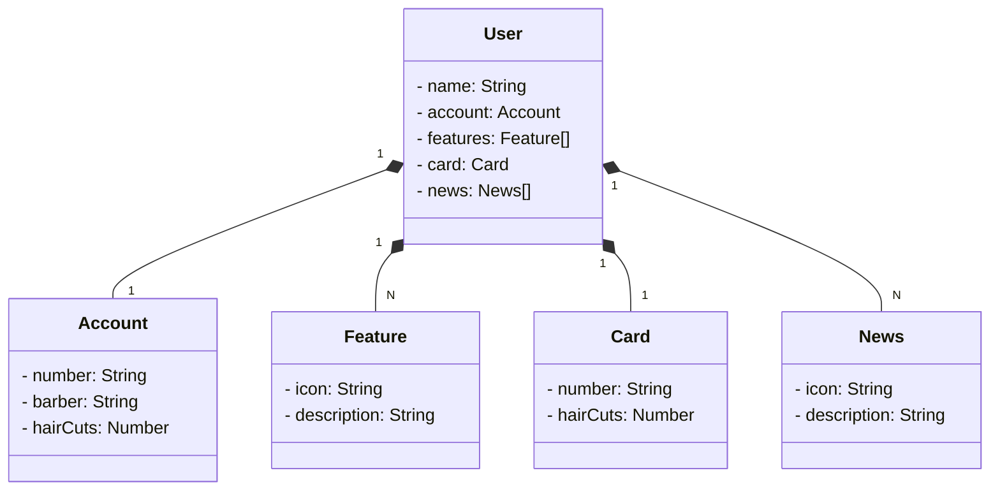

# dio-desafio-projeto-api

### Diagrama de Classes

```mermaid
classDiagram
  class User {
    - name: String
    - account: Account
    - features: Feature[]
    - card: Card
    - news: News[]
  }

  class Account {
    - number: String
    - barber: String
    - hairCuts: Number
  }

  class Feature {
    - icon: String
    - description: String
  }

  class Card {
    - number: String
    - hairCuts: Number
  }

  class News {
    - icon: String
    - description: String
  }

  User "1" *-- "1" Account
  User "1" *-- "N" Feature
  User "1" *-- "1" Card
  User "1" *-- "N" News
```
